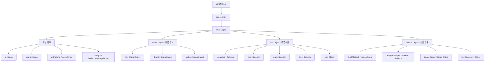

# TokiSync 파싱 규칙 트리 구조 명세 (v1.25.0)

본 문서는 `TreeRuleEditor` 및 파서 엔진에서 사용하는 JSON 규칙의 계층 구조와 각 노드별 상세 명세를 정의한다.

---

## 1. 트리 계층 구조도 (Hierarchy Map)

---

## 2. 노드별 상세 명세 (Node Specification)

### 2.1 루트 및 기본 정보 (Basic Info)

| Key | Type | Description | Tree Editor Hint |
|:---|:---|:---|:---|
| `id` | String | 사이트를 식별하는 유니크 ID (영문/숫자/언더바) | 사이트 고유 ID (영문/숫자) |
| `name` | String | 사용자 UI에 표시될 사이트 이름 | 표시용 이름 |
| `urlPattern` | String | 규칙을 적용할 URL 패턴 (정규표현식) | 적용할 URL 정규표현식 |
| `category` | String | `Webtoon`, `Manga`, `Novel` 중 선택 | 작품 카테고리 |

### 2.2 메타 정보 (`meta`)
작품의 제목, 썸네일, 작가 등 기본 정보를 추출하는 그룹.

| Key | Type | Description |
|:---|:---|:---|
| `title` | Selector | 작품 제목 (예: `h1.title`) |
| `thumb` | Object | `{ selector, attr: "src" }` 형식으로 이미지 주소 추출 |
| `author` | Selector | 작가 이름 정보 |

### 2.3 목록 설정 (`list`)
회차 리스트를 탐색하고 각 회차의 제목, 번호, 링크를 추출하는 그룹.

| Key | Type | Description | Tree Editor Hint |
|:---|:---|:---|:---|
| `container` | Selector | 목록 전체를 감싸는 부모 요소 (예: `ul.list`) | 목록 전체 부모 요소 |
| `item` | Selector | 각 회차 행 요소 (예: `li.item`) | 각 회차 줄 요소 (li 등) |
| `num` | Selector | 회차 번호 (숫자) 추출 영역 | 회차 번호 셀렉터 |
| `title` | Selector | 회차 제목 추출 영역 | 회차 제목 셀렉터 |
| `link` | Object | `{ selector: "a", attr: "href" }` | 회차 상세 연결 링크 |

### 2.4 뷰어 설정 (`viewer`)
실제 이미지나 소설 본문 텍스트를 추출하는 핵심 그룹.

| Key | Type | Description | Tree Editor Hint |
|:---|:---|:---|:---|
| `fetchMethod` | String | `iframe`(기본), `xhr`, `api` 중 로딩 방식 선택 | 로딩 방식 (iframe/xhr/api) |
| `images` | Selector | 웹툰 이미지 태그들의 부모 또는 직접 셀렉터 | 이미지/본문 추출 요소 |
| `imageRegex` | String | 소스코드 내에서 이미지 URL을 직접 찾는 정규식 | URL 직접 추출 정규식 |
| `novelContent`| Selector | 소설 전용: 본문 텍스트가 담긴 요소 | 소설 본문 텍스트 영역 |

---

## 3. 데이터 타입 가이드

1.  **Selector (문자열)**: 단순 CSS 셀렉터. `innerText`를 기본으로 추출한다.
2.  **Object (객체)**: 단순 텍스트 외에 속성(`attr`)이나 정규식(`regex`) 처리가 필요할 때 사용.
    *   예: `{ "selector": "img", "attr": "data-src" }`
3.  **Array (배열)**: `rules` 루트는 항상 객체들의 배열이어야 한다.

---

## 4. 트리 에디터(Tree Editor) 연동 규칙

- **단일 스토리지 연동**: 트리 에디터는 `TOKI_PARSER_RULES` 스토리지를 직접 반영하며, 에디터에 임포트되거나 편집된 규칙들은 실시간으로 수집 엔진에 즉시 동기화됩니다.
- **자동 완성**: 트리 에디터에서 새 규칙 추가 시 위 구조의 **필수 항목**이 기본 템플릿으로 생성된다.
- **유효성 검사**: 저장 시 `id`, `urlPattern`, `category`가 누락되지 않았는지 검증하며, 특히 1.25.0부터는 `id`가 공란이거나 누락될 경우 벤더 분석 오류를 유발할 수 있으므로 에디터 단에서 저장이 제한됩니다.
- **실시간 힌트**: 각 키에 마우스를 올리면 본 문서의 'Tree Editor Hint' 내용이 툴팁으로 출력된다.
