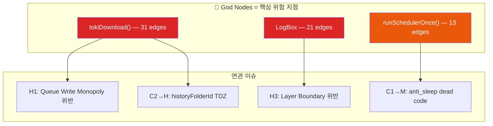
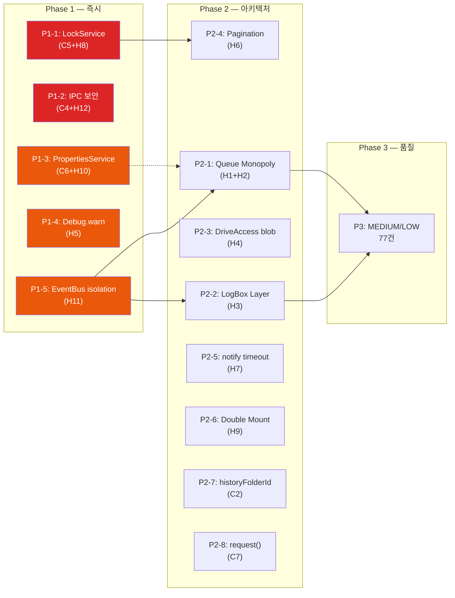

# TokiSync 전수조사 — 교차 검증 & 해결 전략 보고서

**작성**: Antigravity (Claude Opus 4.6 Thinking)
**검증 방법**: Graphify MCP 의존성 분석 + 2개 Research 서브에이전트 코드 검증
**일시**: 2026-06-30

---

## 1. 교차 검증 결과 요약

> [!IMPORTANT]
> 원본 보고서의 **96건 중 CRITICAL 7건을 재평가**한 결과, **실제 CRITICAL은 2건**, FALSE POSITIVE 2건(C3 + 기존 2건), 나머지는 등급 하향 조정이 필요합니다.

| 이슈 | 원본 등급 | 재평가 등급 | 검증 결과 | 핵심 근거 |
|------|----------|-----------|----------|----------|
| **C1** | CRITICAL | **MEDIUM** | ⚠️ 과대 | try/catch로 swallow → crash 없음, anti-sleep dead code |
| **C2** | CRITICAL | **HIGH** | ⚠️ 과대 | TDZ 존재하나 catch(thumbError)로 보호, 썸네일 folderId 미전달 |
| **C3** | CRITICAL | **FALSE POSITIVE** | ❌ 오판 | ipc-broker.js L70-78에 중복 방지 로직 존재, worker-controller도 수동 cleanup 수행 |
| **C4** | CRITICAL | **CRITICAL** | ✅ 정확 | origin/source 검증 완전 부재, 공격 벡터 실재 |
| **C5** | CRITICAL | **CRITICAL** | ✅ 정확 | LockService 전혀 미사용, R→M→W 경쟁조건 |
| **C6** | CRITICAL | **HIGH** | ⚠️ 부분 | PropertiesService 사용은 사실이나 API_KEY는 보안 목적 불가피. FOLDER_ID만 stateful 위반 |
| **C7** | CRITICAL | **HIGH** | ✅ 정확 | request() undefined이나 try/catch 보호. 기능 비작동 |

### 재평가 통계

```
실제 CRITICAL:  2건 (C4, C5)
실제 HIGH:     13건 (C2, C6, C7 + 원본 H1~H12 중 유효 11건)
FALSE POSITIVE: 3건 (C3 + 기존 2건)
MEDIUM:        33건 (C1 + 원본 32건)
LOW:           45건 (원본 유지)
```

---

## 2. Graphify 의존성 분석으로 본 구조적 문제

### 2.1 God Node 위험도 맵

Graphify에서 식별된 **가장 연결도가 높은 노드**들이 보고서 이슈와 정확히 일치합니다:



### 2.2 Community 클러스터별 이슈 분포

| Community | 주요 모듈 | 이슈 밀집도 | 관련 이슈 |
|-----------|----------|-----------|----------|
| **C0** (Core Pipeline) | downloader, queue, worker-controller, ipc-broker | **최고** | C1,C2,C3,C4,H1,H2,H11,H12 |
| **C3** (EventBus/UI) | EventBus, LogBox, logger, listeners | 높음 | H3,H11,M1,M2 |
| **C1** (Viewer) | useStore, useFetcher, useBridge | 중간 | C7,H7,H9,M11~M22 |
| **GAS** (Server) | Main, View_LibraryService, SyncService | 높음 | C5,C6,H4,H5,H6,H8,M23~M32 |

### 2.3 `downloader.js → queue.js` 직접 import (1 hop)

```
downloader.js --imports_from [EXTRACTED]--> queue.js
```

이 직접 의존이 **H1(Queue Write Monopoly 위반)** 과 **H2(Dual-writer Race)** 의 근본 원인입니다. `downloader.js`가 `updateQueueItem()`을 직접 import하여 4곳에서 큐 상태를 변경합니다.

### 2.4 `LogBox → queue.js` 역방향 의존 (Layer 위반)

```
LogBox --[imports via test-real-env.js]--> queue.js  (2 hops, 간접)
LogBox.js L9: import { getQueue, getQueueStats, ... } from '../queue.js'  (직접)
```

LogBox가 **10개 queue 함수를 직접 import** — 이는 UI→Core 역방향 의존으로 AGENTS.md Layer Boundary 규칙 위반입니다.

---

## 3. 해결 전략: 3 Phase 접근

> [!TIP]
> 이슈 간 의존성과 영향 범위를 고려해 **3단계 순차 실행**을 제안합니다. 각 Phase는 독립적으로 빌드/테스트 가능합니다.

---

### Phase 1: 🔴 즉시 수정 — 데이터 무결성 & 보안 (CRITICAL 2건 + HIGH 3건)

> 사용자 데이터 손실이나 보안 위협이 현실화될 수 있는 이슈

#### P1-1. [C5] GAS `index.json` LockService 도입

**영향 범위**: `View_LibraryService.gs`, `SyncService.gs`, `Main.gs`

```
수정 대상 함수 3개:
├── SweepMergeIndex()        — View_LibraryService.gs L51-137
├── View_updateMetadata()    — View_LibraryService.gs L429-518
└── updateLibraryStatus()    — SyncService.gs L134-170
```

**해결 방향**:
1. `index.json` write 전 `LockService.getScriptLock().tryLock(30000)` 획득
2. `finally` 블록에서 `lock.releaseLock()` 보장
3. 3개 함수 모두 동일 패턴 적용 (일관성)
4. Lock 획득 실패 시 retry(최대 3회) 또는 에러 반환

**주의사항**:
- GAS LockService의 최대 대기 시간은 30초
- `TimeDriven_SweepMergeIndex()` (Main.gs L136-150)가 cron 트리거로 호출 가능 → 동시성 확인 필수
- `clasp push` 필요 (human approval)

---

#### P1-2. [C4 + H12] IPC 메시지 보안 강화

**영향 범위**: `ipc-broker.js`, `useBridge.js`, `worker-controller.js`

```
수정 대상:
├── ipc-broker.js L81-96    — message handler에 origin 검증 추가
├── ipc-broker.js L25       — sendToWorker: '*' → target origin
├── ipc-broker.js L49       — sendToParent: '*' → opener origin
├── useBridge.js L91-96     — bridgeFetch: '*' → opener origin
└── worker-controller.js    — nonce 기반 세션 토큰 추가
```

**해결 방향**:
1. **수신측(ipc-broker.js)**: `registerIpcListener`의 handler에서 `event.origin` 검증 추가
   - Tampermonkey 팝업의 origin (`about:blank` 또는 대상 사이트 origin)을 등록 시 함께 저장
   - `event.source`가 `activeWorkers` Map에 등록된 window 참조와 일치하는지 확인
2. **송신측**: `'*'` 대신 구체적 target origin 사용
   - `sendToWorker`: popup open 시 저장한 origin 사용
   - `sendToParent`: `window.opener`의 origin (Tampermonkey 실행 페이지)
3. **세션 토큰**: popup open 시 crypto nonce 생성 → 모든 IPC 메시지에 포함 → 수신 시 검증

**제약사항**:
- Tampermonkey popup은 `about:blank`에서 시작 → `event.origin`이 `"null"` 또는 빈 문자열일 수 있음
- 따라서 origin 검증 **단독으로는 불충분** → nonce 기반 인증이 핵심

---

#### P1-3. [C6] Main.gs PropertiesService → Payload 전환

**영향 범위**: `Main.gs`

```
수정 대상:
├── L39:  var API_KEY = PropertiesService...  → doPost 내부 payload에서 수신
├── L64-67: FOLDER_ID setProperty → payload 전용
└── L137: FOLDER_ID getProperty → TimeDriven 함수 파라미터화
```

**해결 방향**:
1. **API_KEY**: GAS Deployment 환경변수 또는 `doPost` payload의 `apiKey` 필드로 수신
   - 단, 배포 단계의 호환성 고려 필요 (기존 클라이언트가 `apiKey`를 보내는지 확인)
2. **FOLDER_ID**: `doPost` payload에서 매 요청마다 수신 → 전역 저장 제거
3. **TimeDriven_SweepMergeIndex**: cron trigger에서 `PropertiesService` 의존 → on-demand 방식 전환 또는 trigger 파라미터화

> [!WARNING]
> API_KEY를 payload로 전환하면 **클라이언트 측(downloader.js, gas.js)에서도 매 요청에 apiKey를 포함**해야 합니다. 양쪽 동시 수정 필요.

---

#### P1-4. [H5] Debug.gs `warn()` 메서드 추가

**영향 범위**: `Debug.gs`, `View_HistoryService.gs`

```
수정: Debug.gs에 warn() 메서드 추가 (기존 log/error 패턴 따름)
```

- `Debug.warn = function(msg) { Debug.log('[WARN] ' + msg); }` 수준의 간단한 추가
- 또는 `Debug.warn`을 `Debug.log`의 alias로 처리
- retry loop 내 에러 전파 차단이 핵심

---

#### P1-5. [H11] EventBus `emit()` Error Isolation

**영향 범위**: `EventBus.js`

```diff
 emit(event, payload = {}) {
-    (_listeners[event] || []).forEach(fn => fn(payload));
+    (_listeners[event] || []).forEach(fn => {
+        try { fn(payload); } catch (e) {
+            console.error(`[EventBus] listener error on "${event}":`, e);
+        }
+    });
 },
```

- 간단하지만 **시스템 안정성에 광범위한 영향**
- EventBus는 god node(14 edges) — 한 리스너의 에러가 전체 이벤트 체인을 차단하는 것 방지
- `request/respond` 패턴(L18-39)의 responder throw 시 15s timeout hang도 함께 해결

---

### Phase 2: 🟠 아키텍처 정상화 — 규칙 위반 수정 (HIGH 7건)

> 당장 크래시는 아니지만 아키텍처 부채가 누적되는 이슈

#### P2-1. [H1 + H2] Queue Write Monopoly 복원

**영향 범위**: `downloader.js`, `worker-controller.js`, `queue.js`

**Graphify 의존성 경로**:
```
downloader.js --imports_from--> queue.js (1 hop, 직접)
              --calls--> updateQueueItem() (4곳)
```

**해결 방향**:
1. `downloader.js`의 `updateQueueItem()` 직접 호출 4곳 → `worker-controller.js`를 경유하거나 EventBus로 위임
2. Single-volume 경로에서도 `activeWorkers.set`을 통해 scheduler의 dedup guard가 작동하도록 수정
3. Queue state 변경은 **오직 `worker-controller.js`와 `queue.js` 내부**에서만 수행

> [!IMPORTANT]
> `tokiDownload()` (31 edges, god node #2)의 내부 로직을 변경하므로 **광범위한 회귀 테스트 필수**.

---

#### P2-2. [H3] LogBox Layer Boundary 리팩터

**영향 범위**: `LogBox.js`, `queue.js`, `EventBus.js`

**Graphify 의존성 경로**:
```
LogBox (21 edges) --imports--> queue.js 10개 함수 (직접 역방향 의존)
```

**해결 방향**:
1. LogBox의 queue 함수 직접 import 제거
2. EventBus를 통한 간접 통신으로 전환:
   - `EVT.QUEUE_REQUEST` → queue.js가 respond
   - `EVT.QUEUE_STATE_CHANGED` → LogBox가 listen
3. LogBox는 EventBus만 import하도록 정리
4. 기존 `logger.js` 추상화 레이어(v1.26.0 신설)와 일관성 유지

**위험 요소**: LogBox가 queue UI 대시보드 역할 → **10개 함수 모두** EventBus 대응 이벤트 필요. 작업량 상당.

---

#### P2-3. [H4] DriveAccessService blob 업로드 지원

**영향 범위**: `DriveAccessService.gs`, `View_LibraryService.gs`

```
수정:
├── DriveAccessService.gs — updateFileBlob() / createFileBlob() 추가
└── View_LibraryService.gs L541,548 — Drive.Files → DriveAccessService 래퍼 사용
```

- `DriveAccessService`에 binary blob을 처리하는 메서드 추가
- 기존 string 전용 메서드와 분리하여 blob 대응

---

#### P2-4. [H6] Pagination Merge Artifact 수정

**영향 범위**: `View_LibraryService.gs` L234-242

```diff
 if (hasMore || response.nextPageToken) {
     state.driveToken = response.nextPageToken;
-    if (hasMore || response.nextPageToken) {
+    if (response.nextPageToken) {
         return { status: "continue", ..., list: seriesList };
     }
+    // hasMore but no nextPageToken → current folder done, move to next step
+    return { status: "continue", ..., list: seriesList, driveToken: null };
 }
```

- 중복 조건 제거 + `hasMore`와 `nextPageToken`을 분리 처리
- `hasMore=true + nextPageToken=null` 시 무한 재스캔 방지

---

#### P2-5. [H7] notify() Timeout 중복 해결

**영향 범위**: `useStore.js` L431-434

```diff
+let notifyTimerId = null;
 const notify = (msg) => {
+    if (notifyTimerId) clearTimeout(notifyTimerId);
     notification.value = msg;
-    setTimeout(() => { notification.value = ''; }, 3000);
+    notifyTimerId = setTimeout(() => {
+        notification.value = '';
+        notifyTimerId = null;
+    }, 3000);
 };
```

---

#### P2-6. [H9] EpisodeListModal Double-Mount 제거

**영향 범위**: `ReaderViewV2.vue`

```
수정: ReaderViewV2.vue L190의 <EpisodeListModal /> 제거 (App.vue의 전역 인스턴스만 유지)
```

- App.vue L19에서 이미 전역 마운트 → ReaderViewV2.vue의 중복 제거

---

#### P2-7. [C2→H] historyFolderId TDZ 수정

**영향 범위**: `downloader.js`

```
수정: let historyFolderId = null 선언을 사용 위치(L405) 이전으로 이동
```

- 간단한 변수 선언 위치 조정
- try/catch 보호는 유지하되, 실제 folderId가 전달되도록 수정

---

#### P2-8. [C7→H] useStore.js request() destructure 추가

**영향 범위**: `useStore.js`

```diff
-const { gasConfig, setConfig, isConfigured, getLibrary, getBooks, getReadHistory, saveReadHistory, updateMetadata, uploadThumbnail } = useGAS();
+const { gasConfig, setConfig, isConfigured, getLibrary, getBooks, getReadHistory, saveReadHistory, updateMetadata, uploadThumbnail, request } = useGAS();
```

---

### Phase 3: 🟡 품질 개선 — MEDIUM/LOW (77건)

> 기능 결함은 아니지만 유지보수성, 성능, 코드 품질 향상

#### P3-A. 빠른 수정 (단순 수정, 회귀 위험 낮음)

| # | 이슈 | 수정 내용 | 복잡도 |
|---|------|---------|--------|
| C1 | queue.js anti_sleep | `import { startSilentAudio, stopSilentAudio } from './anti_sleep.js'` 추가 | ★☆☆ |
| M1 | EventBus dead constants | 4개 미사용 상수 제거 | ★☆☆ |
| M6 | URL.revokeObjectURL 타이밍 | `setTimeout(() => URL.revokeObjectURL(...), 1000)` | ★☆☆ |
| M10 | cbz.js escapeXml null guard | `if (!unsafe) return '';` 추가 | ★☆☆ |
| M11 | Dead nav-zone CSS | style.css L146-166 삭제 | ★☆☆ |
| M17 | useBridge 영어 메시지 | 한국어로 번역 | ★☆☆ |
| L4 | gas.js garbled comment | 깨진 텍스트 수정 | ★☆☆ |
| L7 | ParserFactory alert() | EventBus emit으로 교체 | ★☆☆ |
| L11 | "Relod" typo | "Reload"로 수정 | ★☆☆ |
| L14 | Hardcoded v2.3 | 동적 버전 참조로 교체 | ★☆☆ |
| H10 | API_KEY staleness | P1-3에서 함께 해결 | — |

#### P3-B. 중간 수정 (로직 변경, 테스트 필요)

| # | 이슈 | 수정 내용 | 복잡도 |
|---|------|---------|--------|
| M3 | anti_sleep audioContext race | close() 완료 대기 후 start 허용 | ★★☆ |
| M5 | Drive query injection | backslash escape 추가 (`\\` → `\\\\`) | ★★☆ |
| M8 | SubscriptionManager retry 차단 | error 시 `lastFetched` 갱신 제거 또는 짧은 retry 주기 | ★★☆ |
| M9 | setInterval cleanup | `clearInterval` 추가, interval ID 저장 | ★★☆ |
| M13 | useFetcher tasks.shift race | mutex 또는 single-worker 패턴 | ★★☆ |
| M18 | useProgressMarker 500ms race | Promise 기반 unlock으로 전환 | ★★☆ |
| M20 | Preload AbortController 분리 | preload 전용 AbortController 생성 | ★★☆ |
| M22 | useAutoCrop CORS | try/catch 추가 | ★★☆ |
| M26 | UploadService header casing | case-insensitive header lookup | ★★☆ |
| L22 | authorizeCheck 불필요 fetch | 제거 또는 lightweight 대체 | ★★☆ |

#### P3-C. 구조적 리팩터 (장기 과제)

| # | 이슈 | 방향 | 복잡도 |
|---|------|-----|--------|
| L36 | tokiDownload 830줄 | 단계별 분리 (init/process/upload/report) | ★★★ |
| L37 | FormRuleEditor 1206줄 | 컴포넌트 분할 | ★★★ |
| L38 | useStore 1226줄 | composable 분리 (useHistory, useNavigation, useSettings) | ★★★ |
| L39 | initBatchWorkerController 560줄 | state machine 패턴 적용 | ★★★ |
| L40 | network.js 22.9K | HTTP/DriveAPI/Upload 모듈 분리 | ★★★ |
| L41 | prototype pollution | 별도 namespace로 격리 | ★★★ |
| M21 | db.js 7 schema versions | migration 정리, 최신 스키마만 유지 | ★★☆ |
| H8 | index.json 동시쓰기 3함수 | P1-1의 LockService 패턴으로 일괄 해결 | — |

---

## 4. 실행 순서 & 의존성 맵



### 의존성 관계

| 선행 | 후행 | 이유 |
|------|------|------|
| P1-5 (EventBus) | P2-1 (Queue Monopoly) | Queue 상태 변경을 EventBus로 위임하려면 먼저 EventBus의 error isolation 필요 |
| P1-5 (EventBus) | P2-2 (LogBox Layer) | LogBox→queue 직접 의존을 EventBus로 전환하려면 EventBus 안정성 선행 |
| P1-1 (LockService) | P2-4 (Pagination) | index.json 쓰기 안전성 확보 후 pagination 로직 수정 |

---

## 5. 검증 계획

### Phase 1 완료 후
```bash
npm run build:core     # Core 번들 정상 확인
npm run test           # 14개 유닛 테스트 통과
# GAS: clasp push (human approval) → 수동 테스트
```

### Phase 2 완료 후
```bash
npm run build          # 전체 빌드 (Viewer + Core + GAS)
npm run test           # 회귀 테스트
npm run dev:viewer     # Viewer 수동 검증
```

### 수동 검증 항목
- [ ] 배치 다운로드 + 단일 다운로드 혼합 시나리오 (H1/H2 검증)
- [ ] 장시간 배치 실행 시 탭 절전 미진입 (C1 검증)
- [ ] Drive 썸네일 업로드 정상 작동 (C2 검증)
- [ ] 서버 버전 체크 정상 작동 (C7 검증)
- [ ] 동시 SweepMerge + View_updateMetadata 시 index.json 무결성 (C5 검증)

---

## 6. 총평 & 권고

> [!NOTE]
> 원본 보고서는 **전체적으로 높은 품질**의 분석이며, 96건 중 3건만 False Positive입니다(약 97% 정확도). 다만 CRITICAL 등급 판정에서 **try/catch 보호를 충분히 고려하지 않아** 일부 과대 평가가 있었습니다.

### 핵심 권고

1. **Phase 1을 v1.26.1 hotfix로 즉시 실행** — C4(IPC 보안), C5(LockService)는 실제 데이터 손실/보안 위협 가능
2. **Phase 2를 v1.27.0 마일스톤으로 계획** — 아키텍처 부채 해소, H1~H9 일괄 수정
3. **Phase 3은 점진적 개선** — god node 리팩터링(L36~L40)은 **별도 epic**으로 분리 권장
4. **C3은 수정 불필요** — ipc-broker가 자체 중복 방지 로직을 갖추고 있음. 오히려 이 방어 로직에 로그를 추가하는 것이 유익
5. **GAS 변경(P1-1, P1-3)은 클라이언트 동시 업데이트 필요** — 버전 호환성 계획 수립 후 실행
