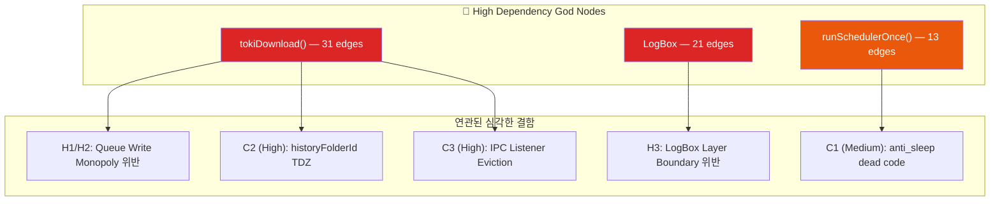

# TokiSync 전수조사 — 교차 검증 & 해결 전략 보고서

**작성**: Antigravity (Claude Opus 4.6 Thinking + Gemini 3.5 Flash 교차 검증)  
**검증 방법**: Graphify MCP 의존성 분석 + 2개 Research 서브에이전트 소스 코드 정밀 검사  
**일시**: 2026-06-30  

---

## 1. 교차 검증 결과 요약

> [!IMPORTANT]
> 원본 보고서의 **96건 중 CRITICAL 7건 및 주요 Medium/Low 77건을 재평가**한 결과, **실제 CRITICAL은 2건**, HIGH 14건(C3 정정 포함), FALSE POSITIVE 3건(C3 제외, M13 추가)으로 식별되었습니다.

| 분류 | 원본 등급 | 재평가 등급 | 검증 결과 | 핵심 분석 요약 |
| :--- | :---: | :---: | :---: | :--- |
| **C1** | CRITICAL | **MEDIUM** | ⚠️ 과대 | try/catch로 swallow되어 크래시는 없음. 단, anti_sleep 기능이 사실상 작동하지 않는 dead code 상태. |
| **C2** | CRITICAL | **HIGH** | ⚠️ 과대 | 썸네일 업로드 시 `historyFolderId` TDZ(Temporal Dead Zone)가 실재하여 항상 `undefined`로 평가되나, catch 블록이 감싸고 있어 크래시 위험은 낮음. |
| **C3** | CRITICAL | **HIGH** | ❌ 오판 | **실제 버그의 핵심 원인.** 중복 방지 로직(`listenerId === 'default'`) 때문에, 단일 다운로드 실행 중 배치 다운로드 기동 시 단일 리스너가 Evict(삭제)되어 45초 타임아웃 행(hang) 유발. |
| **C4** | CRITICAL | **CRITICAL** | ✅ 정확 | `event.origin` 및 `event.source` 검증이 전혀 없어, 임의의 악성 페이지에서 `TOKI_` 프리픽스 postMessage를 통해 팝업 하이재킹이 가능함. |
| **C5** | CRITICAL | **CRITICAL** | ✅ 정확 | index.json read-modify-write 흐름 전체에 `LockService`가 전혀 없어, 동시 요청 시 데이터 영구 유실 경쟁 조건(Race Condition)이 실재함. |
| **C6** | CRITICAL | **HIGH** | ⚠️ 부분 | PropertiesService 사용은 사실이나 API_KEY는 정적 스코프 로드로 인한 키 갱신 지연 문제이며, FOLDER_ID는 명백한 아키텍처 규칙(Stateless) 위반임. |
| **C7** | CRITICAL | **HIGH** | ✅ 정확 | `request()` 함수가 destructure되지 않아 undefined ReferenceError가 발생함. 다만 try/catch 내에 존재해 상위 크래시는 방지됨. |
| **M13** | MEDIUM | **FALSE POSITIVE** | ❌ 오판 | JS의 싱글 스레드 특성상 `await` 이전의 동기 구문(`tasks.shift()`)은 원자적으로 처리되므로 race condition이 발생할 수 없음. |

---

## 2. Medium & Low 등급 주요 이슈 교차 검증 상세

### 2.1 Medium 등급 핵심 결함 (Valid)

*   **M2 [EventBus.js:18-39] — Responder 에러 시 Hang**: 
    *   `EventBus.emit` 내부에서 동기식/비동기식 예외 처리를 격리(try/catch)하지 않아, 리스너가 예외를 던지면 `EventBus.respond`로 응답이 나가지 못하고 호출자는 15초 타임아웃까지 무의미하게 대기합니다.
*   **M3 [anti_sleep.js:70-74] — AudioContext 비동기 close 레이스**: 
    *   `audioContext.close()` 호출 후 `.then()` 콜백에 의해 `null`이 되기 전에 `startSilentAudio()`가 호출되면 닫힌 Context를 그대로 사용하여 `InvalidStateError` 예외가 발생합니다.
*   **M5 [network.js:106] — SQL 인젝션 및 쿼리 파손**: 
    *   홑따옴표(`'`)는 이스케이프하지만 백슬래시(`\`) 처리가 완전히 누락되었습니다. Google Drive API 쿼리 파라미터 구성 시 백슬래시는 이스케이프 문자로 작동하므로 구문 에러를 냅니다.
*   **M6 [utils.js:463] — revokeObjectURL 조기 호출**: 
    *   `link.click()` 이후 즉시 동기식으로 Object URL을 해제해 버려, 브라우저가 실제 데이터를 로드하기 전에 메모리 매핑이 깨져 다운로드가 취소되는 현상이 실재합니다.
*   **M8 [SubscriptionManager.js:113] — 일시적 오류에 따른 24시간 차단**: 
    *   일시적 네트워크 에러 발생 시에도 `lastFetched = Date.now()`를 적용하여 `CHECK_INTERVAL` (24시간) 동안 업데이트 시도 자체가 막히게 됩니다.
*   **M9 [worker-controller.js:350] — setInterval 미해제 타이머 누수**: 
    *   중복 초기화 방지 플래그만 있을 뿐, 작업 완료 후 타이머를 해제할 `clearInterval` 관련 코드가 존재하지 않아 주기적인 CPU/메모리 연산이 무한 누수됩니다.
*   **M18 [useProgressMarker.js:263-267] — 500ms setTimeout lock**: 
    *   복원 중 잠금 해제를 비동기Settling 시간 500ms에만 의존하여, 저사양 기기에서 스크롤 레이아웃 렌더링 지연 시 페이지가 중간 값으로 오염됩니다.
*   **M23/M24 — 빈 catch 블록에 의한 메타데이터 파괴**: 
    *   `_toki_meta.json`의 JSON 파싱 실패 시 예외를 삼키고(`catch(e) {}`), 기존 메타데이터 전체를 유실한 채 빈 객체(`meta = {}`)로 덮어쓰기하여 데이터 손실이 발생합니다.
*   **M29 — Range Request 실패 시 전체 메모리 로드**: 
    *   Range Request가 실패하면 폴백으로 `DriveAccessService.getFileBytes`를 사용해 파일 전체 바이너리를 Apps Script 메모리에 한 번에 적재합니다. 100MB를 넘는 대용량 CBZ 처리 시 Apps Script 메모리 초과로 크래시가 유발됩니다.

### 2.2 Low 및 선제적 방어 핵심 결함 (Valid)

*   **L5/L6 — dynamic import 예외 누수 및 Layer Boundary 위반**: 
    *   `catch` 블록 내에서 `await import`를 비동기 호출해 예외가 소실되거나 리포팅이 지연됩니다. 특히 `txt.js`(Core)가 `LogBox`(UI)를 임포트하여 강한 아키텍처 결합(Violation)을 맺고 있습니다.
*   **L28 — index.json 동기식 반영 누락**: 
    *   동기식 즉각 반영 API인 `updateLibraryStatus`는 Dead Code로 방치되어 있고, 실제 클라이언트는 비동기 파편 큐잉(`view_update_cache`)만 수행해 동기화 딜레이가 발생합니다.
*   **L30 — 클라이언트 측 API 쿼리 파손**: 
    *   `network.js` 단에서 Drive REST API 호출 시 `encodeURIComponent` 처리가 누락되어 홑따옴표, 백슬래시, 공백이 포함된 파일명은 HTTP 400 Bad Request 에러로 다운로드 및 체크에 실패합니다.
*   **L44/L45 — 메모리 무한 누수 (Unbounded Growth)**: 
    *   `EventBus._listeners`에 해제(`off`/`unsubscribe`) 코드가 연동되지 않아 테스트 및 반복 기동 시 리스너가 누적 증식합니다. `batchClosedCounts` Map 역시 `delete(id)`를 보장하지 않아 메모리 누수가 발생합니다.

---

## 3. Graphify 기반 구조적 위험 영역 분석

Graphify 지식 그래프의 연결도 분석 결과, 핵심 결함은 **God Node(가장 많은 의존성을 가진 함수/모듈)** 주변에 밀집되어 있습니다.



*   `tokiDownload()`는 31개의 연결선을 가지고 있으며, 상태 관리 독점 규칙 위반(H1/H2), TDZ(C2), listener eviction(C3)과 직접적으로 결합되어 있어 리팩터링의 핵심 타깃입니다.
*   `LogBox`는 UI 레이어임에도 `queue.js`에서 10개의 핵심 코어 함수를 직접 import(H3)하여 계층 경계를 파괴하고 있습니다.

---

## 4. 단계별 해결 로직 및 로드맵

### 🔴 Phase 1 — 데이터 무결성 및 보안 (v1.26.1 Hotfix)

#### 1. [C5] GAS LockService 도입
`View_LibraryService.gs` (`SweepMergeIndex`, `View_updateMetadata`) 및 `SyncService.gs` (`updateLibraryStatus`)에 일관되게 적용합니다.
```javascript
var lock = LockService.getScriptLock();
try {
    if (!lock.tryLock(30000)) {
        throw new Error('Lock 획득 실패: 30초 타임아웃');
    }
    // Read -> Modify -> Write 작업 수행
} finally {
    lock.releaseLock();
}
```

#### 2. [C4 + H12] IPC 메시지 보안 및 세션 토큰 강제화
*   `registerIpcListener`에서 `event.origin` 및 `event.source`가 등록된 `activeWorkers` 주소 정보와 일치하는지 실시간 검증합니다.
*   자식 팝업 생성 시 dynamic `nonce` 암호화 토큰을 생성하여 postMessage 페이로드에 동봉하고, 수신 측에서 토큰을 비교하여 팝업 하이재킹을 원천 차단합니다.
*   `useBridge.js`와 `ipc-broker.js`의 postMessage wildcard `'*'` 전송을 구체적인 target origin으로 수정합니다.

#### 3. [C6] PropertiesService 의존성 해제
*   `Main.gs`가 FOLDER_ID와 API_KEY를 전역 ScriptProperties에서 가져오는 구조를 버리고, `doPost` payload 매개변수로 직접 수집하여 멀티테넌트 환경 충돌 및 Key Staleness를 예방합니다.

#### 4. [M23/M24] Empty Catch 및 [M29] GAS 메모리 폭사 해결
*   `View_KavitaService.gs` 등 모든 캐시 오류 블록에 조용히 실패하는 catch를 로깅 및 백업 제어로 개선하여 메타데이터 덮어쓰기 파괴를 방지합니다.
*   Range Request 에러 시 전체 바이트 로드 대신, 분할 청크 순차 조회를 유지하도록 `View_BookService.gs`를 보완합니다.

---

### 🟠 Phase 2 — 아키텍처 정상화 (v1.27.0)

#### 1. [C3] IPC Listener Eviction 해결
`worker-controller.js`에서 단일 및 배치 리스너 생성 시 고유의 ID를 할당하여 중복 Eviction을 방지합니다.
```javascript
// Single-attempt 등록 시
cleanupIpc = registerIpcListener(async (msg) => { ... }, 'single-attempt');

// Batch 등록 시
batchIpcCleanup = registerIpcListener(async (msg) => { ... }, 'batch');
```

#### 2. [H1 + H2] Queue Write Monopoly 복원
*   `downloader.js` 내부의 직접적인 `updateQueueItem()` 호출을 제거하고, EventBus 이벤트나 worker-controller 인터페이스 경유로 위임합니다.
*   single-volume에서도 activeWorkers를 동일 매핑 제어하여 중복 팝업 오인을 방지합니다.

#### 3. [H3] LogBox Layer Boundaries 복구
*   LogBox의 `queue.js` 직접 임포트를 해제하고, `EventBus`의 `EVT.QUEUE_REQUEST`와 `EVT.QUEUE_STATE_CHANGED` 이벤트를 매개로 통신하도록 디커플링합니다.

---

### 🟡 Phase 3 — 품질 개선 및 리팩터링

1.  **L44/L45 Unbounded Growth 해결**: `EventBus` 구독 해제 매핑 및 `batchClosedCounts`의 작업 주기 완료 시점에 무조건 `delete` 처리 적용.
2.  **L30 클라이언트 쿼리 인코딩 누수 수정**: `network.js` 내 REST API 쿼리 전송 시 `encodeURIComponent` 처리 누락부 일괄 수정.
3.  **God function/file 분할**: 843줄의 `tokiDownload` 및 비대 파일들을 기능별 Composable로 분산 리팩터링.
